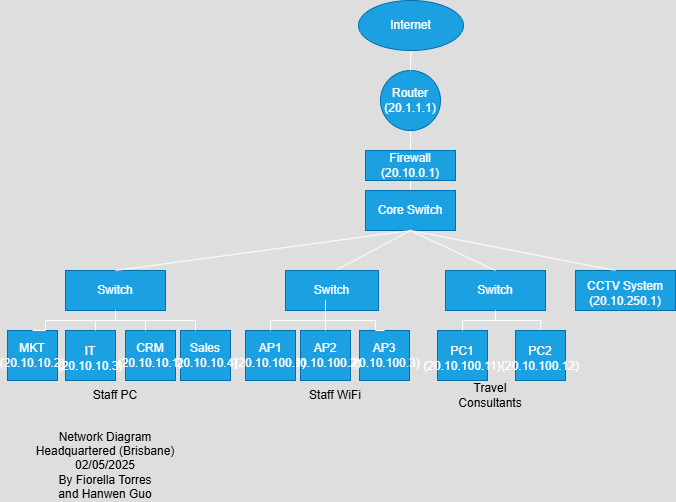

# Network Design
*This section gives the detailed network design.*

[Assumptions](#assumptions) | [Network Design Diagrams and Justifications](#network-design-diagrams-and-justifications) | [WiFi Design](#wifi-design) | [Address Allocations](#address-allocations) | [Recommended Hardware](#recommended-hardware) | [Plan](./plan.md) | [Cloud Services](./cloud.md) | [Security](./security.md) | [Ethics](./ethics.md) | [Reflection](./reflection.md) | [Return to index](./README.md)

## Assumptions

- Headquarters Location: Brisbane
- Branch Offices: Sydney, Melbourne, Rockhampton
- Staff at Headquarters: 70
- Staff at Branch Office (Sydney): 25
- All offices require internet, internal services access, and VPN capability

## Network Design Diagrams and Justifications
* Headquarters Location (Brisbane)
  

* Branch Offices (Sydney)
  

## Explanation:

####  Headquarter
The headquarter network is designed to support 70 staff across multiple departments including Marketing, IT, Sales, accountant, as well as internal servers and a CCTV system.
  
### Network Structure:
We chose the star topology because devices can be connected directly to a central switch or hub, making the network easy to monitor, control, and secure. It also provides high performance, as each device has a dedicated connection, which reduces congestion.
Internet access comes through a router connected to a firewall to filter traffic.
The Core Switch distributes traffic to multiple Access Switches, each connected to:
- Staff PCs (Marketing, IT, CRM, Sales)
- Staff WiFi via access points (AP1–AP3)
- Travel Consultants’ PCs
- A CCTV system

####  Branch Office
The Sydney branch supports 25 staff and connects to the main office in Brisbane through a secure site-to-site VPN. Its design is simple yet scalable and secure.

Network Structure:
A Cisco ISR router (20.2.1.1) connects to the Internet.
A FortiGate firewall (20.20.0.1) protects internal resources.
A Core Switch distributes traffic to two Access Switches:
- One for wired staff and travel consultant PCs
- One for WiFi APs (covering the office)
- VPN tunnel which links the branch to the headquarter securely.

## WiFi Design
####  Headquarters
WiFi APs are deployed to cover the entire headquarters.
They are connected via a dedicated switch and assigned static IPs in the 20.10.100.0/24 range.
Devices connected to WiFi (BYOD, mobile, laptops) receive IPs via DHCP from the same subnet.
Travel consultants are also assigned IPs from this WiFi subnet, e.g., 20.10.100.11, 20.10.100.12.

####  Branch Office
Access Points serve the entire Sydney office WiFi.
Assigned static IPs within the 20.20.0.0/24 subnet
DHCP for wireless devices provided from the same subnet.
Staff consultants use wired PCs with assigned static IPs.

## Address Allocations
####  Headquarters
| Device / Dept    | IP Address       | Subnet             |
| ---------------- | ---------------- | ------------------ |
| Router           | 20.1.1.1         | Public WAN         |
| Firewall         | 20.10.0.1        | DMZ / Internal WAN |
| Marketing PC     | 20.10.10.1       | Staff PC Subnet    |
| IT PC            | 20.10.10.2       | Staff PC Subnet    |
| CRM PC           | 20.10.10.3       | Staff PC Subnet    |
| Sales PC         | 20.10.10.4       | Staff PC Subnet    |
| AP1 / AP2 / AP3  | 20.10.100.1\~3   | WiFi Subnet        |
| Travel PC1 / PC2 | 20.10.100.11\~12 | WiFi Subnet        |
| CCTV System      | 20.10.250.1      | CCTV Subnet        |

####  Branch Office
| Device / Role         | IP Address            | Subnet                 |
| --------------------- | --------------------- | ---------------------- |
| Router                | 20.2.1.1              | Public WAN             |
| Firewall              | 20.20.0.1             | Branch Internal        |
| Staff PC1 / PC2 / PC3 | 20.20.0.1\~0.3        | Wired Staff PC         |
| AP1 / AP2             | 20.20.0.4\~0.5        | Branch WiFi            |
| VPN Tunnel Endpoint   | (logical) 20.20.0.254 | VPN Site-to-Site to HQ |

## Recommended Hardware

| Item Type       | Manufacturer | Model                      | Ports (No.) | Speed             | Quantity | Cost (AUD) | Link |
|----------------|--------------|----------------------------|--------------|--------------------|----------|------------|------|
| Router (HQ)    | Cisco        | ISR 4331                   | 3            | WAN: 1 Gbps        | 1        | $3,600     | [Cisco ISR 4331](https://www.cisco.com/c/en/us/products/routers/4000-series-integrated-services-routers-isr/index.html) |
| Firewall (HQ)  | Fortinet     | FortiGate 100F             | 12           | 1 Gbps – 10 Gbps   | 1        | $4,500     | [FortiGate 100F](https://www.fortinet.com/products/next-generation-firewall/fortigate-100f) |
| Core Switch    | Cisco        | Catalyst 9300 (C9300-24T)  | 24           | 1 Gbps/10 Gbps     | 1        | $5,500     | [Cisco Catalyst 9300](https://www.cisco.com/c/en/us/products/switches/catalyst-9300-series-switches/index.html) |
| Access Switch  | Cisco        | Catalyst 9200 (C9200-48P)  | 48           | 1 Gbps             | 3        | $3,200     | [Cisco Catalyst 9200](https://www.cisco.com/c/en/us/products/switches/catalyst-9200-series-switches/index.html) |
| Wireless AP    | Aruba        | Instant On AP22            | Dual-band    | WiFi 6 (1.2 Gbps)  | 6        | $280       | [Aruba AP22](https://www.arubainstanton.com/au/products/access-points/ap22) |
| Server         | Dell         | PowerEdge R450             | 4x NIC       | 10 Gbps            | 3        | $6,800     | [Dell PowerEdge R450](https://www.dell.com/en-au/work/shop/povw/poweredge-r450) |
| CCTV Camera    | Hikvision    | DS-2CD2146G1-I              | PoE          | 4MP, 2688x1520     | 8        | $240       | [Hikvision Camera](https://www.hikvision.com/en/products/IP-Products/Network-Cameras/) |
| Router (Branch)| Cisco        | ISR 4321                   | 2            | WAN: 1 Gbps        | 1        | $2,400     | [Cisco ISR 4321](https://www.cisco.com/c/en/us/products/routers/4000-series-integrated-services-routers-isr/index.html) |
| Firewall (Branch) | Fortinet | FortiGate 60F              | 10           | 1 Gbps             | 1        | $1,800     | [FortiGate 60F](https://www.fortinet.com/products/next-generation-firewall/fortigate-60f) |
| Switch (Branch)| Cisco        | CBS350-24T-4G              | 24           | 1 Gbps             | 1        | $1,000     | [Cisco CBS350](https://www.cisco.com/c/en/us/products/switches/business-350-series-managed-switches/index.html) |
